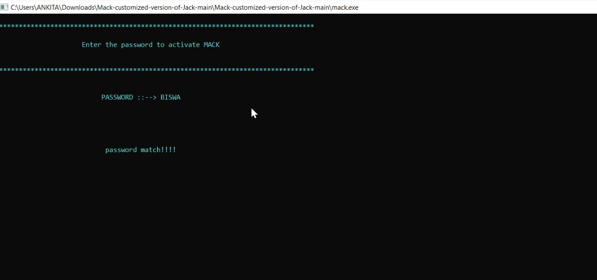
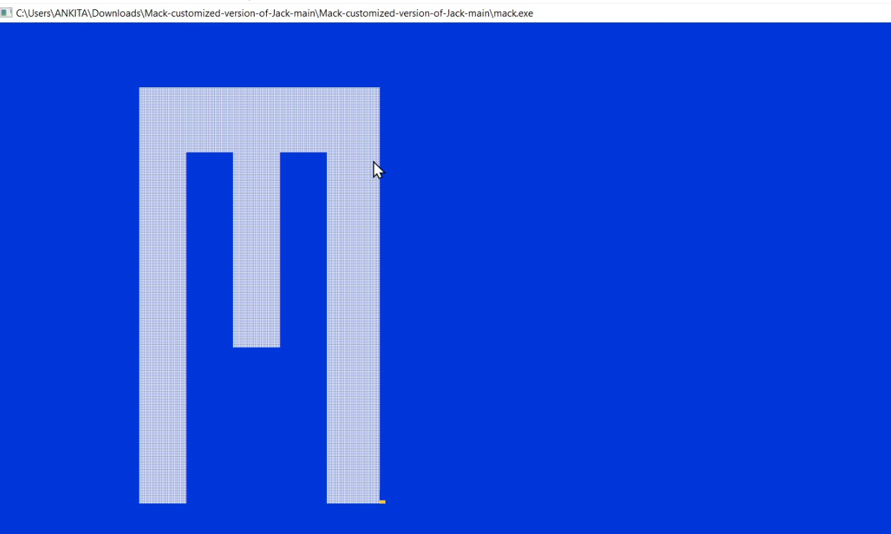
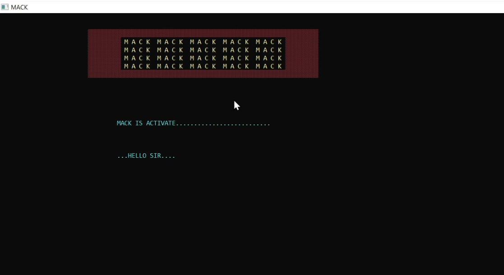
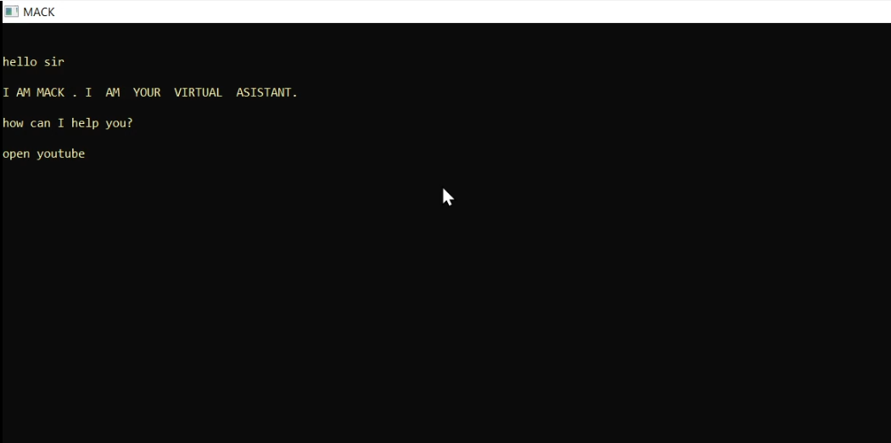
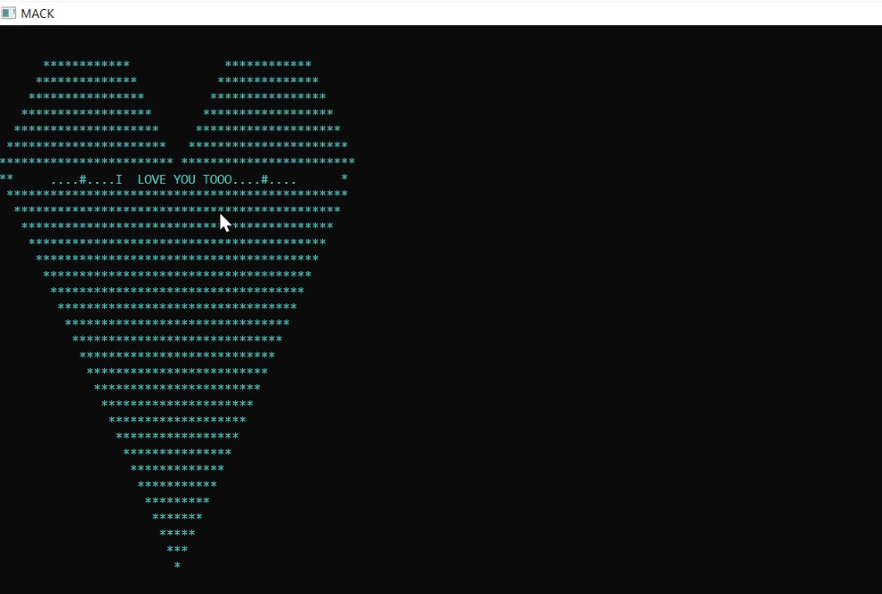
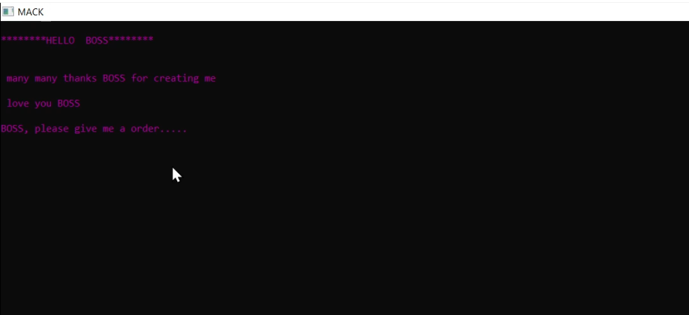
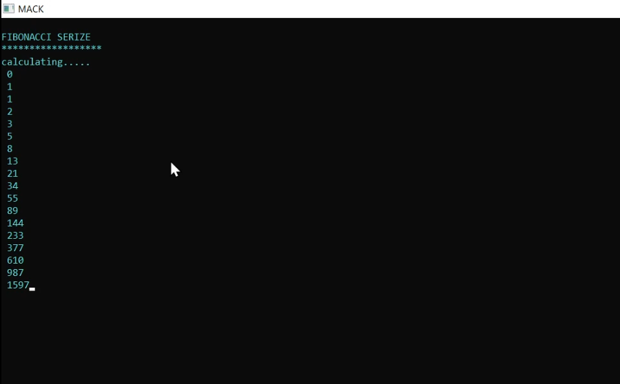
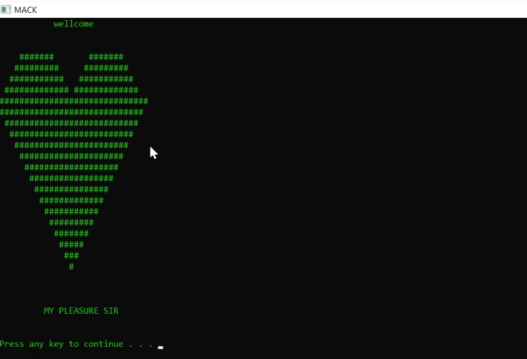

# MACK-VIRTUAL-ASSISTANT  :star_struck: :open_mouth: :running: :star2:

[](https://shields.io/) 
<br>

***This new MACK Virtual Assistant using Python is created by Biswarup Bhattacharjee, student of BTECH, in University of Engineering and Management, Kolkata.***

**Email Id: bbiswa471@gmail.com.** 

**Contact No: 916290272740.** 


<p align="left">
<a href="https://www.facebook.com/profile.php?id=100070395300810" target="blank"></a>
<a href="https://instagram.com/biswarup2210" target="blank"></a>
<a href="https://github.com/biswa2210" target="blank"></a>
</p>

## About :point_down: 

<div align="justified">
    
MACK is a virtual assistant. It takes user whatever user wants to open like google, you tube, system realted applications etc. It is a customized and updated version of JACK. It can check even odd, prime, palindrome, fibonacci etc numbers in range or normally it can check. Mack can take us to my other C applications like student database, bank, restaurant and snake game etc.
 
</div>

## MACK DEMO VIDEO: :point_right: <a href="https://www.youtube.com/watch?v=zTgZ4neZ1Do&list=PL0lbDlMJ1h4g3cSTY44VyQ4Z-5L4kbo2a&index=6">Click here to watch</a>

## C and C++ PLAYLIST: :point_right: <a href="https://www.youtube.com/watch?v=m5VnSust32E&list=PL0lbDlMJ1h4g3cSTY44VyQ4Z-5L4kbo2a">Click here to watch</a>

## Purpose :point_down:

<div align="justified">
    
I have made this so that I can easily work with applications.

</div>


## Folder Structure :point_down:

```bash
MACK-VIRTUAL-ASSISTANT
    ├── BANK.exe
    ├── Rb.exe
    ├── SCHOOL.exe
    ├── mack.cpp
    ├── mack.exe
    ├── mack.o
    └── snake.exe
```
    
## Screenshots :point_down: 

<div align="center">
    
<a href="mack1.png"></a> 
    
<a href="mack2.png"></a> 
    
<a href="mack3.png"></a> 
    
<a href="mack4.png"></a> 
    
<a href="mack5.png"></a> 
    
<a href="mack6.png"></a> 
    
<a href="mack7.png"></a> 
    
<a href="mack8.png"></a> 

</div>


